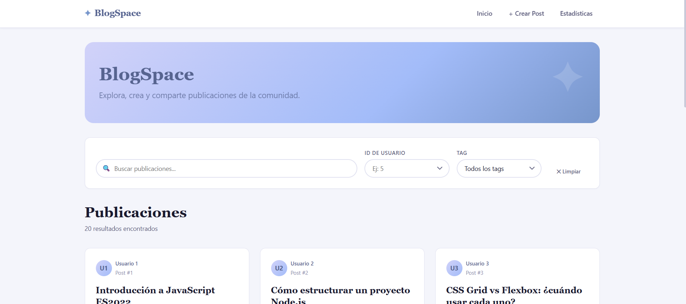
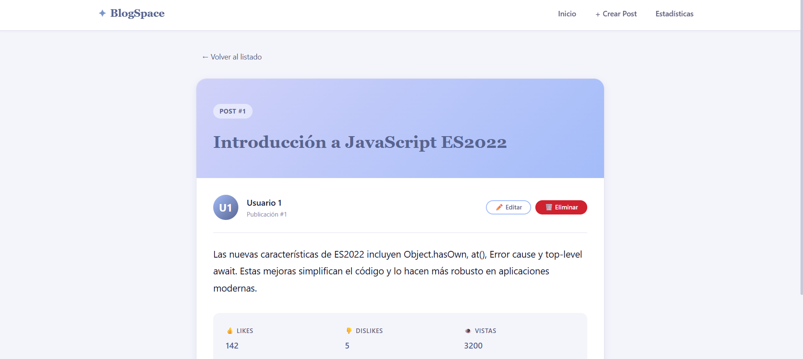
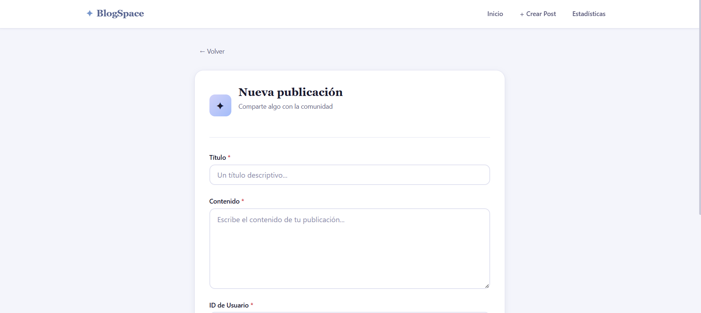
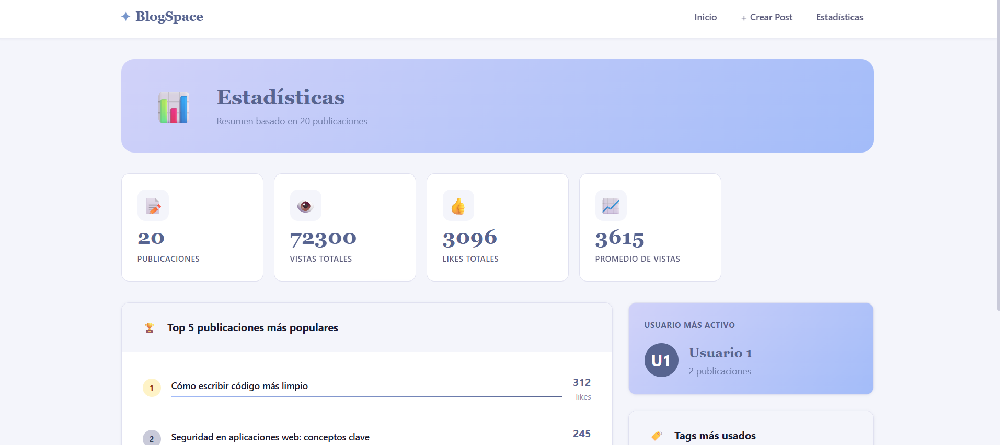

# BlogSpace 📝

Aplicación web tipo blog con operaciones CRUD completas, construida con HTML, CSS y JavaScript Vanilla (ES2022+), sin frameworks de frontend.

---

## Descripción

BlogSpace es una plataforma de publicaciones donde los usuarios pueden ver, crear, editar y eliminar posts. La aplicación cuenta con sistema de paginación, filtros por texto, por usuario y por etiquetas (tags), una sección de estadísticas generales y feedback visual en cada operación (loaders, skeletons, toasts y modales de confirmación).

Todo el proyecto está dividido en módulos ES independientes y utiliza una API REST propia construida con Node.js y Express.

---

## API utilizada

El proyecto implementa una **API propia** desarrollada con Node.js + Express, ubicada en la carpeta `/api`. Esta API expone los siguientes endpoints:

| Método | Endpoint | Descripción |
|--------|----------|-------------|
| GET | `/posts?limit=N&skip=N` | Listado paginado de posts |
| GET | `/posts/search?q=texto` | Búsqueda por texto en título y cuerpo |
| GET | `/posts/tags` | Lista de todos los tags disponibles |
| GET | `/posts/tag/:tag` | Posts filtrados por tag |
| GET | `/posts/user/:userId` | Posts filtrados por usuario |
| GET | `/posts/:id` | Detalle de un post específico |
| POST | `/posts/add` | Crear un nuevo post |
| PUT | `/posts/:id` | Editar un post existente |
| DELETE | `/posts/:id` | Eliminar un post |

La API corre en `http://localhost:3001` e incluye CORS habilitado para permitir la comunicación con el frontend.

---

## Screenshots

### Listado de publicaciones


### Vista de detalle


### Formulario de crear post


### Sección de estadísticas



---

## Estructura del proyecto

```
CC3062-PROY1/
├── api/
│   ├── server.js        # API REST con Express.js
│   └── package.json     # Dependencias del servidor
├── css/
│   ├── main.css         # Variables globales y estilos base
│   ├── layout.css       # Navegación, grids y responsive
│   └── components.css   # Cards, botones, formularios, toasts, modal
├── js/
│   ├── api.js           # Funciones fetch hacia la API
│   ├── router.js        # Enrutador por hash
│   ├── main.js          # Estado global y coordinación de vistas
│   ├── ui.js            # Renderizado dinámico del DOM
│   └── validation.js    # Validaciones de formularios
└── index.html           # Estructura HTML base
```

---

## Instrucciones de uso

### Requisitos previos
- Node.js instalado (versión 18 o superior)
- Un editor con Live Server (se recomienda VS Code)

### Paso 1 — Instalar dependencias de la API

Abrir una terminal en la carpeta del proyecto y ejecutar:

```bash
cd api
npm install
```

### Paso 2 — Iniciar la API

```bash
npm start
```

La terminal debe mostrar:
```
BlogSpace API corriendo en http://localhost:3001
```

Dejar esta terminal abierta mientras se usa la aplicación.

### Paso 3 — Abrir el frontend

En VS Code, hacer clic derecho sobre `index.html` y seleccionar **"Open with Live Server"**.

La aplicación se abrirá en `http://127.0.0.1:5500`.

---

## Integrantes

- Diana Sosa 
- Biancka Raxón 

---

## Video de demostración

[](https://youtu.be/X5Llkw-An4g)

🔗 [https://youtu.be/X5Llkw-An4g](https://youtu.be/X5Llkw-An4g)

[](https://youtu.be/yNWK22WPjAA) (versión corta)

🔗 [https://youtu.be/yNWK22WPjAA](https://youtu.be/yNWK22WPjAA)


